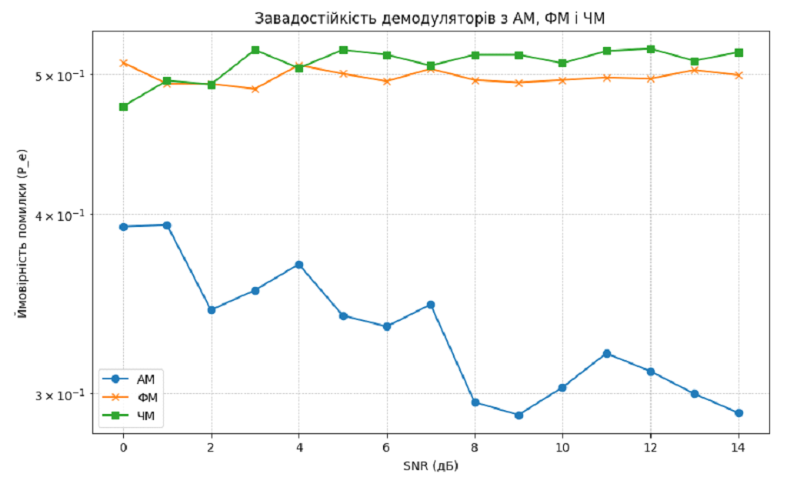

# Signal Demodulator Robustness Analysis under Varying Noise Conditions (AM, FM, FSK)

## Project Overview

This project simulates the robustness of signal demodulators for Amplitude Modulation (AM), Frequency Modulation (FM), and Frequency Shift Keying (FSK) under varying Signal-to-Noise Ratios (SNR). Leveraging **Python's NumPy** and **Matplotlib**, the program models noisy communication channels, demodulates signals, and quantitatively evaluates the Bit Error Rate (BER) as a function of noise level.

---

## Business & Analytical Value

Reliable communication in noisy environments is critical for sectors such as:

- Telecommunications and wireless networks  
- Internet of Things (IoT) devices  
- Quality assurance in signal processing systems  
- Research and development of modulation schemes

This analysis provides actionable insights for selecting modulation methods that optimize error resilience, thereby improving system reliability and user experience.

---

## Technical Highlights

- **Signal generation:** Binary sequences modulated using AM, FM, and FSK techniques  
- **Noise modeling:** Addition of Gaussian noise across a range of SNR values (0 to 14 dB)  
- **Demodulation methods:** Envelope detection for AM, phase unwrapping for FM, correlation approach for FSK  
- **Performance evaluation:** Bit Error Rate (BER) computed to measure demodulator error probability  
- **Visualization:** Log-scale BER vs. SNR plots to clearly demonstrate noise impact  

---

## Visualization Example

*Bit Error Rate (BER) decreases as Signal-to-Noise Ratio (SNR) increases, demonstrating the noise resilience of AM, FM, and FSK demodulators.*

---

## Tools & Technologies

- Python 3.x  
- NumPy for numerical signal processing  
- Matplotlib for data visualization and plotting  
